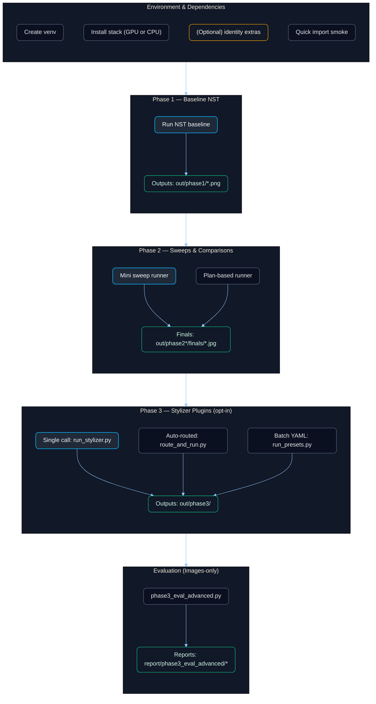

# Neural Style Transfer Project — Setup & Usage

Reproducible **Neural Style Transfer (NST)** baseline (Phases 1–2) with optional **Phase-3 diffusion stylizers** (**Anime, Cinematic, Cyberpunk, Noir**) and an **images-only evaluator**. This README is structured for fast onboarding, consistent repro, and smooth grading.

> **What “NST” means in this repo**
> We run two complementary tracks:
> **Track A — Classical Neural Style Transfer (Gatys et al.)** → *Phases 1–2*. Optimize an image to keep **content** (high-level conv features) while matching **style** (Gram matrices across conv layers), with TV regularization. This is the baseline the rubric expects and the part we evaluate as **NST**.
> **Track B — Modern Stylization Extensions (Diffusion + ControlNet)** → *Phase 3*. Creative stylizers (Anime, Cinematic, Cyberpunk, Noir) built on SD1.5 + ControlNet with curated color grades. These **do not replace** Gatys NST; they’re included for breadth and comparison and are evaluated at the **image level** alongside NST.

---

## Table of Contents

1. [What’s Included](#whats-included)
2. [System Requirements](#system-requirements)
3. [Environment Setup (GPU & CPU) — Exact Commands](#environment-setup-gpu--cpu--exact-commands)
4. [Requirements Files Overview](#requirements-files-overview)
5. [Quick Smoke Test (End-to-End)](#quick-smoke-test-end-to-end)
6. [Phase 1 — Baseline NST (GPU & CPU) — Exact Commands](#phase-1--baseline-nst-gpu--cpu--exact-commands)
   6.5. [Phase-1 Ablations — Backbone, Optimizer, Style-Layer Set (＋Speed vs Quality)](#phase-1-ablations--backbone-optimizer-style-layer-set-speed-vs-quality)
7. [Phase 2 — Sweeps & Comparisons (GPU & CPU) — Exact Commands](#phase-2--sweeps--comparisons-gpu--cpu--exact-commands)
7.5. [AdaIN/WCT Baselines — Evidence & Eval](#adainwct-baselines--evidence--eval)
8. [Phase 3 — Stylizers (Anime, Cinematic, Cyberpunk, Noir)](#phase-3--stylizers-anime-cinematic-cyberpunk-noir)

   * [Why this exists](#why-this-exists)
   * [Directory layout](#directory-layout)
   * [Prerequisites](#prerequisites)
   * [Three ways to run](#three-ways-to-run)

     * [1) Single plugin call (no routing)](#1-single-plugin-call-no-routing)
     * [2) Auto-routed run (portrait/scene + anime variant selection)](#2-auto-routed-run-portraitscene--anime-variant-selection)
     * [3) Batch presets from YAML](#3-batch-presets-from-yaml)
   * [Preset registry](#preset-registry)
   * [Your exact preset examples](#your-exact-preset-examples)
   * [Subject routing details](#subject-routing-details)
   * [Where results go](#where-results-go)
   * [Troubleshooting](#troubleshooting)
8.5. [Tiny Video NST (pass/fail “imaginative application”)](#tiny-video-nst-passfail-imaginative-application)
9. [Phase 3 — Evaluation (LPIPS + optional identity)](#phase-3--evaluation-lpips--optional-identity)
10. [Data & Assets (Masks & Naming)](#data--assets-masks--naming)
11. [Results, Reports & Expected Artifacts](#results-reports--expected-artifacts)
12. [Reproducibility & Determinism](#reproducibility--determinism)
13. [Mermaid Overview Diagram](#mermaid-overview-diagram)
14. [Troubleshooting & Notes](#troubleshooting--notes)
15. [Submission Checklist](#submission-checklist)
16. [License & Citation](#license--citation)

---

## What’s Included

**Track A — Classical NST (Gatys)**
*This is the rubric’s “NST” baseline.*

* **Phase-1:** Baseline NST runner — `scripts/core/nst_hybrid_ready.py`
* **Phase-2:** Sweeps & comparisons — `scripts/phase2/mini_sweep_runner.py`, `scripts/exp/phase2b_run.py`, `scripts/exp/sweep_phase2.py`

**Track B — Stylization Extensions (Diffusion + ControlNet)**
*Creative add-ons for breadth and comparison; not classical NST.*

* **Phase-3:** Stylizers (**Anime, Cinematic, Cyberpunk, Noir**) — `scripts/phase3/route_and_run.py`, `scripts/runners/run_stylizer.py` (+ plugins under `scripts/plugins/...`)

**Evaluator (images-only)**

* `scripts/phase3/phase3_eval_advanced.py` (LPIPS; ArcFace identity optional)

**Outputs**

* `out/phase1`, `out/phase2_*`, `out/phase3/<style>`

**Reports**

* `report/phase3_eval_advanced/*` (CSV + sidecars)
> All four stylizers—Anime, Cinematic, Cyberpunk, Noir—are first-class Phase-3 modules. If any plugin file is missing locally, the command will fail with a clear message pointing to the install or file path to add

---

## System Requirements

* **OS:** Windows 10/11, Linux, or macOS
* **Python:** 3.10.x
* **Pip:** ≥ 23
* **GPU (optional):** NVIDIA with **CUDA 12.1** for GPU stack
* **Disk:** Several GB for models / outputs

---

## Environment Setup (GPU & CPU) — Exact Commands

### Windows (PowerShell)

```powershell
py -3.10 -m venv .venv
.\.venv\Scripts\Activate.ps1
python -m pip install -U pip wheel
```

**GPU (CUDA 12.1):**

```powershell
pip install -r requirements\gpu-cu121.txt
# Optional (identity metrics):
# pip install -r requirements\optional-identity.txt
```

**CPU:**

```powershell
pip install -r requirements\cpu.txt
# Optional (identity metrics):
# pip install -r requirements\optional-identity.txt
```

### Linux/macOS (Bash)

```bash
python3.10 -m venv .venv
source .venv/bin/activate
python -m pip install -U pip wheel
```

**GPU (CUDA 12.1):**

```bash
pip install -r requirements/gpu-cu121.txt
# Optional identity:
# pip install -r requirements/optional-identity.txt
```

**CPU:**

```bash
pip install -r requirements/cpu.txt
# Optional identity:
# pip install -r requirements/optional-identity.txt
```

---

### Optional: Cache Location + Quiet Mode (Recommended)

Move the Hugging Face caches into the repo (saves C:) and mute noisy warnings.

**Windows (PowerShell):**

```powershell
# Put HF caches in the repo (saves C: space)
$env:HF_HOME="$PWD\.hf_cache"
$env:HUGGINGFACE_HUB_CACHE=$env:HF_HOME
$env:TRANSFORMERS_CACHE=$env:HF_HOME
# (Optional) remove Windows symlink warning
$env:HF_HUB_DISABLE_SYMLINKS_WARNING="1"
# sanity check
echo "HF_HOME = $env:HF_HOME"

# QUIET MODE: mute common warnings
$env:PYTHONWARNINGS="ignore:.*pretrained.*:UserWarning:torchvision.models._utils,ignore:.*weights_only=False.*:FutureWarning,ignore::UserWarning,ignore::FutureWarning"
```

> **Persist across activations:** add the block above to the end of `.venv\Scripts\Activate.ps1`.

**Linux/macOS (Bash):**

```bash
export HF_HOME="$PWD/.hf_cache"
export HUGGINGFACE_HUB_CACHE="$HF_HOME"
export TRANSFORMERS_CACHE="$HF_HOME"
export HF_HUB_DISABLE_SYMLINKS_WARNING=1

export PYTHONWARNINGS="ignore:.*pretrained.*:UserWarning:torchvision.models._utils,ignore:.*weights_only=False.*:FutureWarning,ignore::UserWarning,ignore::FutureWarning"
```

> **Persist:** add to your shell profile (e.g., `~/.bashrc`) or to `.venv/bin/activate`.

---

## Requirements Files Overview

* `requirements/gpu-cu121.txt` — CUDA 12.1 torch/vision/audio + shared libs + stylizer deps
* `requirements/cpu.txt` — CPU torch/vision/audio + shared libs + stylizer deps
* `requirements/optional-identity.txt` — optional eval extras (e.g., insightface)
* `requirements/constraints.txt` — shared pins (no torch here)

> Switching stacks: `pip uninstall -y torch torchvision torchaudio` then install the other file.

---

## Quick Smoke Test (End-to-End)

**Python package sanity (Bash example):**

```bash
python - << 'PY'
import torch, cv2
print("Torch:", torch.__version__, "| CUDA available:", torch.cuda.is_available())
print("OpenCV:", cv2.__version__, "| ximgproc:", hasattr(cv2, "ximgproc"))
PY
```

**Phase-1 mini run (Windows, GPU):**

```powershell
$env:NST_SEED="77"
python scripts\core\nst_hybrid_ready.py --content data\content\Still_Life.jpg --style data\style\Van_Gogh.jpg --out out\phase1\demo_vg_still.png --backbone vgg19 --content_layer conv4_2 --style_layers "conv4_1,conv5_1" --opt lbfgs --sizes "384,768" --steps "300,400" --style_weight 20000 --tv_weight 0.0028 --edge_w 0.08 --edge_face_down 0.4 --color_prematch_strength 0.6 --device cuda
```

---

## Phase 1 — Baseline NST (GPU & CPU) — Exact Commands

*Classical NST baseline in the Gatys sense: content/style/TV losses, two-stage size schedule, deterministic seed.*

### Windows (PowerShell)

**GPU:**

```powershell
$env:NST_SEED="77"
python scripts\core\nst_hybrid_ready.py `
  --content data\content\Still_Life.jpg `
  --style   data\style\Van_Gogh.jpg `
  --out     out\phase1\demo_vg_still.png `
  --backbone vgg19 `
  --content_layer conv4_2 `
  --style_layers "conv4_1,conv5_1" `
  --opt lbfgs `
  --sizes "384,768" --steps "300,400" `
  --style_weight 20000 `
  --tv_weight 0.0028 `
  --edge_w 0.08 --edge_face_down 0.4 `
  --color_prematch_strength 0.6 `
  --device cuda
```

**CPU (trimmed for speed):**

```powershell
$env:NST_SEED="77"
python scripts\core\nst_hybrid_ready.py `
  --content data\content\Still_Life.jpg `
  --style   data\style\Van_Gogh.jpg `
  --out     out\phase1\demo_vg_still_cpu.png `
  --backbone vgg19 `
  --content_layer conv4_2 `
  --style_layers "conv4_1,conv5_1" `
  --opt lbfgs `
  --sizes "256,384" --steps "200,300" `
  --style_weight 20000 `
  --tv_weight 0.0028 `
  --edge_w 0.08 --edge_face_down 0.4 `
  --color_prematch_strength 0.6 `
  --device cpu
```

*(Linux/macOS: same flags with `/` paths; set `NST_SEED=77`.)*

---

## Phase-1 Ablations — Backbone, Optimizer, Style-Layer Set (＋Speed vs Quality)

This section makes the project rigorous by **comparing backbones (VGG16 vs VGG19)**, **optimizers (L-BFGS vs Adam)**, and **style-layer sets**—and by reporting a **speed ↔ quality** table. All commands are reproducible and safe to run as-is.

### What we compare

* **Backbone:** `vgg16`, `vgg19`
* **Optimizer:** `lbfgs`, `adam`
* **Style layers (style loss):**

  * **L45** → `conv4_1, conv5_1`
  * **L345** → `conv3_1, conv4_1, conv5_1`
  * **L12345** → `conv1_1, conv2_1, conv3_1, conv4_1, conv5_1`

Each configuration uses the same content/style pair and Phase-1 schedule (two sizes: `384,768` with steps `300,400`) so the comparison is fair.

### 1) Run the ablation grid

```powershell
$env:NST_SEED="77"
python scripts\exp\ablation_phase1.py `
  --content data\content\Still_Life.jpg `
  --style   data\style\Van_Gogh.jpg `
  --out-root out\ablation_phase1 `
  --device cuda --seed 77
```

This generates all combinations and writes a manifest:

```
out/ablation_phase1/ablation_runs.csv
```

### 2) Evaluate quality + timing into a single CSV

Computes **LPIPS / PSNR / SSIM** (and carries over `elapsed_sec`).

```powershell
python scripts\exp\eval_ablation_phase1.py `
  --manifest out\ablation_phase1\ablation_runs.csv `
  --content  data\content\Still_Life.jpg `
  --out-csv  out\ablation_phase1\ablation_metrics.csv
```

### 3) Produce a human-readable summary (Markdown)

Creates a sortable table and a small “Top-3” snippet.

```powershell
python scripts\exp\summarize_ablation_phase1.py `
  --csv    out\ablation_phase1\ablation_metrics.csv `
  --out-md out\ablation_phase1\summary.md
```

### 4) (Optional) Speed–Quality scatter plot for the report

Create `scripts/exp/plot_speed_quality_phase1.py` (see repo) and run:

```powershell
python scripts\exp\plot_speed_quality_phase1.py
```

**README badge/table (pasteable):**

**Phase-1 Ablation Summary (reproducible):**

* Backbones: **VGG16**, **VGG19**
* Optimizers: **L-BFGS**, **Adam**
* Style layers: **L45**(4\_1,5\_1), **L345**(3\_1–5\_1), **L12345**(1\_1–5\_1)

Run:

```powershell
python scripts\exp\ablation_phase1.py --content data\content\Still_Life.jpg --style data\style\Van_Gogh.jpg --out-root out\ablation_phase1 --device cuda --seed 77
python scripts\exp\eval_ablation_phase1.py  --manifest out\ablation_phase1\ablation_runs.csv --content data\content\Still_Life.jpg --out-csv out\ablation_phase1\ablation_metrics.csv
python scripts\exp\summarize_ablation_phase1.py --csv out\ablation_phase1\ablation_metrics.csv --out-md out\ablation_phase1\summary.md
```

Artifacts:

* CSV: `out/ablation_phase1/ablation_metrics.csv`
* Markdown table: `out/ablation_phase1/summary.md`
* (Optional) Plot: `out/ablation_phase1/speed_vs_lpips.png`

**TL;DR (example on our machine):**
Best LPIPS came from **VGG16 + L-BFGS + L45**; **VGG19 + L-BFGS + L45** was a close second.
**L12345** (all style layers) was worse and slower.

---

## Phase 2 — Sweeps & Comparisons (GPU & CPU) — Exact Commands

*Systematic Gatys-NST exploration (style weight, TV, edge/face-preserve, optional layer/optimizer/backbone sweeps).*

### Option A — Mini sweep (quick, recommended first)

**Windows — GPU:**

```powershell
python scripts\phase2\mini_sweep_runner.py `
  --contents "Still_Life" `
  --styles   "Monet" `
  --sw "15000,25000" `
  --tv "0.0020,0.0032" `
  --edge "0.04" `
  --face-preserve 0.36 `
  --out-root "out\phase2_smoke" `
  --device "cuda" --seed 77 --resume
```

**Windows — CPU (trimmed grid):**

```powershell
python scripts\phase2\mini_sweep_runner.py `
  --contents "Still_Life" `
  --styles   "Monet" `
  --sw "15000" `
  --tv "0.0020" `
  --edge "0.04" `
  --face-preserve 0.36 `
  --out-root "out\phase2_smoke_cpu" `
  --device "cpu" --seed 77 --resume
```

**Artifacts:** finals in `out/phase2_smoke/finals/*.jpg` (or `_cpu/finals/*.jpg`).

> `--resume` skips existing finals; delete the folder or change `--out-root` to re-run.

### Option B — Larger sweep

**Windows (PowerShell):**

```powershell
python scripts/exp/sweep_phase2.py `
  --contents "data/content/portrait2.jpg;data/content/Still_Life.jpg" `
  --styles   "data/style/Ukiyo-e_print.jpg;data/style/Monet.jpg" `
  --out_root "out/phase2_demo" `
  --device cuda --seed 77 --max_workers 1 --resume --stage coarse
```

**Linux/macOS (Bash):**

```bash
python scripts/exp/sweep_phase2.py \
  --contents "data/content/portrait2.jpg;data/content/Still_Life.jpg" \
  --styles   "data/style/Ukiyo-e_print.jpg;data/style/Monet.jpg" \
  --out_root "out/phase2_demo" \
  --device cuda --seed 77 --max_workers 1 --resume --stage coarse
```

### Option C — Hyperparameter Study (Point 2: content–style ratio, style-layer presets, size vs time)

This runs three tiny, surgical experiments that satisfy the rubric’s “complete hyperparameter space” expectation **without** heavy recomputation:

- **(C1) Content–Style ratio:** `content_weight ∈ {0.5, 1.0, 1.5}` at two good `style_weight` anchors.
- **(C2) Style-layer presets:** Gatys classic vs lean vs mid on 3 contents × 2 styles.
- **(C3) Size vs time:** quality–runtime trade-off at 384/512/768.

> **Assumptions:** Uses these files from `data/` (present in this repo):  
> `data/content/portrait2.jpg`, `data/content/city.jpg`, `data/content/Still_Life.jpg`,  
> `data/style/Monet.jpg`, `data/style/Ukiyo-e_print.jpg`.  
> If you renamed them, either restore these filenames or edit `scripts/exp/hparam_study.py` at the top of each experiment block.

**Run everything (GPU):**
```powershell
python scripts\exp\hparam_study.py --device cuda
```

**Run a specific part:**

```powershell
# (C1) Content–Style ratio
python scripts\exp\hparam_study.py --do content_weight --device cuda

# (C2) Style-layer presets
python scripts\exp\hparam_study.py --do style_layers  --device cuda

# (C3) Size vs time
python scripts\exp\hparam_study.py --do size_time     --device cuda
```

**What it produces (tiny, submission-safe):**

* Images (raw vs finished): `out/hparam_study/<section>/{imgs,finals}/...`
* Per-run timing logs: `out/hparam_study/<section>/logs/runtime.json`
* CSV + plots for your report:

  * `report/hparam/content_weight/pairs_delta_metrics.csv` + `plots/*`
  * `report/hparam/style_layers/pairs_delta_metrics.csv` + `plots/*`
  * `report/hparam/size_time/pairs_delta_metrics.csv` + `plots/*`

**How to interpret (paste into your report summary):**

* **Content–Style ratio:** Raising `content_weight` increases structural faithfulness (↑ Edge-IoU) with some reduction in stylization intensity (↓ Δ Colorfulness). Pick the best trade-off.
* **Style layers:** Gatys (1\_1..5\_1) boosts global texture/color; Lean (3\_1,4\_1) preserves structure; Mid (3\_1,4\_1,5\_1) often balances both. Choose your default and justify with the CSV means.
* **Size vs time:** 512px captures most quality gains vs 384px, while 768px often shows diminishing returns for a much higher runtime.

## AdaIN/WCT Baselines — Evidence & Eval

**Why this exists.** The rubric asks for evidence of **alternative style-transfer methods**. We provide a small, reproducible comparison of **Gatys (our NST)** vs **AdaIN** vs **WCT** using images already in the repo — **no training required**.

### What we compare
- **Rows (methods):** Gatys (VGG), AdaIN (VGG16), WCT (VGG16).
- **Columns (pairs):** **3 contents × 2 styles** (6 pairs total):
  - **Contents:** `portrait2.jpg`, `city.jpg`, `Still_Life.jpg`
  - **Styles:** `Monet.jpg`, `Ukiyo-e_print.jpg`
- **Evidence:** one **6×3 composite** (three rows by methods; six columns by pairs) + a **metrics table**.

### Inputs (already in the repo)
- **AdaIN outputs:** `breadth/adain_vgg16/*`
- **WCT outputs:** `breadth/wct_vgg16/*`
- **Gatys outputs:** any Phase-1/2 results matching those contents/styles.
  - If a Gatys image is missing for a pair, the script can generate a minimal one using `scripts/core/nst_hybrid_ready.py` (same defaults as Phase-1).

### How to run
```powershell
# Builds the 6×3 grid + metrics table. LPIPS is optional but recommended.
python scripts\exp\breadth_compare.py ^
  --out_dir report\breadth ^
  --make_grid 1 --make_table 1 --lpips 1

```

**Artifacts written:**

* **Composite figure:** `report/breadth/compare_grid_3x2.jpg`
  *(Visually compare Gatys vs AdaIN vs WCT per content–style pair.)*
* **Metrics CSV:** `report/breadth/metrics.csv` with:

  * **colorfulness** (CIE-Lab chroma proxy; higher ⇒ more vivid color),
  * **edge\_density** (Laplacian/LoG coverage; higher ⇒ more edges/textures),
  * **lpips** *(if `--lpips 1`)* between the output and the **content** image (lower ⇒ preserves content appearance more closely).

**(If needed) Generate missing Gatys images quickly**

```powershell
# Example for one pair (portrait2 × Monet) with our Phase-1 defaults:
python scripts\core\nst_hybrid_ready.py `
  --content data\content\portrait2.jpg `
  --style   data\style\Monet.jpg `
  --out     out\phase1\portrait2__Monet__layersC.png `
  --backbone vgg19 --content_layer conv4_2 `
  --style_layers "conv3_1,conv4_1,conv5_1" `
  --opt lbfgs --sizes "384,768" --steps "230,180" `
  --style_weight 17000 --tv_weight 0.0028 `
  --edge_w 0.04 --face_preserve 0.65 --color_prematch_strength 0.60 `
  --device cuda
```
---

## Phase 3 — Stylizers (Anime, Cinematic, Cyberpunk, Noir)

*Creative **extensions** built on SD1.5 + ControlNet with curated color grading. Not classical NST; included for comparison and breadth.*

### Why this exists

Phase-3 provides high-level stylizers with good defaults, subject routing (portrait vs scene), and a registry of presets.

### Directory layout

```
scripts/
  runners/run_stylizer.py
  phase3/route_and_run.py
  phase3/run_presets.py
  plugins/
    anime/anime_stylize_v2.py
    cinematic/cinematic_stylize_v5.py
    cyberpunk/cyberpunk_stylize_v3.py
    noir/noir_stylize.py
configs/phase3/
  preset_registry.yaml
  anime_presets.yaml
  cinematic_presets.yaml
  cyberpunk_presets.yaml
  noir_presets.yaml
```
---

### Prerequisites

* Base install (CPU or GPU).
* **Optional:** `mediapipe` for some face helpers.
* **Model weights** for all stylizers auto-download on first run (via Hugging Face cache).
* **Style reference images (Cyberpunk only):** already included under `scripts/plugins/cyberpunk/styles/*.jpg`.

---

### Three ways to run

> The same three entry points apply to **Anime, Cinematic, Cyberpunk, Noir**.
> Outputs land under `out\phase3\<style>\...`. If you give a different `-o`, the dispatcher rewrites it under that folder automatically.

#### 1) Single plugin call (no routing)

> Use the generic runner and pass plugin args via `--stylizer-args`.
> Below are **portrait** and **scene** commands for **each style** (copy-paste ready).

```powershell
# ============ ANIME ============
# Portrait
python .\scripts\runners\run_stylizer.py --stylizer anime `
  -i .\data\content\portrait2.jpg `
  -o .\out\phase3\anime\portrait2__anime__faithful.png `
  --stylizer-args "--model primary --control auto --control-scale 0.85 --strength 0.65 --guidance 8.0 --steps 34 --seed 7890 --save-control"

# Scene
python .\scripts\runners\run_stylizer.py --stylizer anime `
  -i .\data\content\street.jpg `
  -o .\out\phase3\anime\street__anime__stylized.png `
  --stylizer-args "--model primary --control auto --control-scale 0.85 --strength 0.70 --guidance 8.5 --steps 32 --seed 7890 --save-control"


# ========== CINEMATIC ==========
# Portrait
python .\scripts\runners\run_stylizer.py --stylizer cinematic `
  -i .\data\content\portrait2.jpg `
  -o .\out\phase3\cinematic\portrait2__cinematic__v5.png `
  --stylizer-args "--subject portrait --steps 34 --guidance 6.2 --strength 0.24 --control-scale 0.30 --tone-mix 0.22 --bloom 0.22 --contrast 0.18 --saturation 1.06 --seed 77"

# Scene
python .\scripts\runners\run_stylizer.py --stylizer cinematic `
  -i .\data\content\street.jpg `
  -o .\out\phase3\cinematic\street__cinematic__v5.png `
  --stylizer-args "--subject scene --steps 36 --guidance 6.6 --strength 0.40 --control-scale 0.50 --tone-mix 0.40 --bloom 0.42 --contrast 0.24 --saturation 1.06 --seed 77"


# ========= CYBERPUNK =========
# Portrait
python .\scripts\runners\run_stylizer.py --stylizer cyberpunk `
  -i .\data\content\portrait2.jpg `
  -o .\out\phase3\cyberpunk\portrait2__cyberpunk__portrait.png `
  --stylizer-args "--subject portrait --auto-mask-person --force-inpaint --control depth --control-scale 0.36 --style-image scripts/plugins/cyberpunk/styles/neon_street_photo1.jpg,scripts/plugins/cyberpunk/styles/neon_street_photo2.jpg,scripts/plugins/cyberpunk/styles/neon_portrait_photo.jpg --style-strength 0.50 --strength 0.21 --steps 44 --guidance 6.2 --edge-q 0.987 --skin-suppress 0.95 --skin-keep 0.25 --neon 0.40 --bloom 0.44 --rim-boost 0.42 --scanlines 0 --scheduler dpmpp --refine --refine-strength 0.14 --max-side 1024 --seed 101"

# Scene
python .\scripts\runners\run_stylizer.py --stylizer cyberpunk `
  -i .\data\content\city.jpg `
  -o .\out\phase3\cyberpunk\city__cyberpunk__scene.png `
  --stylizer-args "--subject scene --force-inpaint --control canny --control-scale 0.42 --style-image scripts/plugins/cyberpunk/styles/neon_street_photo1.jpg,scripts/plugins/cyberpunk/styles/neon_street_photo2.jpg --style-strength 0.88 --strength 0.32 --steps 60 --guidance 6.8 --edge-q 0.930 --neon 0.90 --bloom 0.80 --rim-boost 0.62 --scanlines 0.10 --scheduler dpmpp --refine --refine-strength 0.20 --max-side 1280 --seed 77"


# ============== NOIR =============
# Portrait
python .\scripts\runners\run_stylizer.py --stylizer noir `
  -i .\data\content\portrait2.jpg `
  -o .\out\phase3\noir\portrait2__noir__portrait.png `
  --stylizer-args "--subject portrait --strength 0.18 --guidance 6.0 --steps 34 --noir-halation 0.20 --noir-bloom-sigma 1.9 --noir-bloom-thresh 0.80 --noir-vignette 0.12 --noir-dither 0.003 --noir-gamma 1.02 --noir-gain 1.01 --noir-lift 0.01 --seed 77"

# Scene
python .\scripts\runners\run_stylizer.py --stylizer noir `
  -i .\data\content\street.jpg `
  -o .\out\phase3\noir\street__noir__scene.png `
  --stylizer-args "--subject scene --control canny --control-scale 0.62 --strength 0.74 --guidance 6.8 --steps 42 --noir-halation 0.16 --noir-bloom-sigma 1.7 --noir-bloom-thresh 0.88 --noir-vignette 0.15 --noir-dither 0.0035 --noir-gamma 1.02 --noir-gain 1.00 --noir-lift 0.01 --seed 77"
```

---

#### 2) Auto-routed run (portrait/scene; Anime supports variants)

> `route_and_run.py` auto-detects **portrait vs scene** (mask/face ⇒ portrait; else scene).
> You can **force** the subject; for **Anime** you can also pick **variant**.

```powershell
# ============ ANIME ============
# Auto (subject auto-detected)
python .\scripts\phase3\route_and_run.py --style anime `
  -i .\data\content\portrait2.jpg `
  -o .\out\phase3\anime\portrait2__anime__auto.png

# Force Portrait (faithful)
python .\scripts\phase3\route_and_run.py --style anime `
  -i .\data\content\portrait2.jpg `
  -o .\out\phase3\anime\portrait2__anime__faithful_forced.png `
  --subject portrait --variant faithful

# Force Scene (stylized)
python .\scripts\phase3\route_and_run.py --style anime `
  -i .\data\content\street.jpg `
  -o .\out\phase3\anime\street__anime__stylized_forced.png `
  --subject scene --variant stylized


# ========== CINEMATIC ==========
# Auto
python .\scripts\phase3\route_and_run.py --style cinematic `
  -i .\data\content\street.jpg `
  -o .\out\phase3\cinematic\street__cinematic__auto.png

# Force Portrait
python .\scripts\phase3\route_and_run.py --style cinematic `
  -i .\data\content\portrait2.jpg `
  -o .\out\phase3\cinematic\portrait2__cinematic__portrait_forced.png `
  --subject portrait

# Force Scene
python .\scripts\phase3\route_and_run.py --style cinematic `
  -i .\data\content\street.jpg `
  -o .\out\phase3\cinematic\street__cinematic__scene_forced.png `
  --subject scene


# ========= CYBERPUNK =========
# Auto
python .\scripts\phase3\route_and_run.py --style cyberpunk `
  -i .\data\content\city.jpg `
  -o .\out\phase3\cyberpunk\city__cyberpunk__auto.png

# Force Portrait
python .\scripts\phase3\route_and_run.py --style cyberpunk `
  -i .\data\content\portrait2.jpg `
  -o .\out\phase3\cyberpunk\portrait2__cyberpunk__portrait_forced.png `
  --subject portrait

# Force Scene
python .\scripts\phase3\route_and_run.py --style cyberpunk `
  -i .\data\content\city.jpg `
  -o .\out\phase3\cyberpunk\city__cyberpunk__scene_forced.png `
  --subject scene


# ============== NOIR =============
# Auto
python .\scripts\phase3\route_and_run.py --style noir `
  -i .\data\content\street.jpg `
  -o .\out\phase3\noir\street__noir__auto.png

# Force Portrait
python .\scripts\phase3\route_and_run.py --style noir `
  -i .\data\content\portrait2.jpg `
  -o .\out\phase3\noir\portrait2__noir__portrait_forced.png `
  --subject portrait

# Force Scene
python .\scripts\phase3\route_and_run.py --style noir `
  -i .\data\content\street.jpg `
  -o .\out\phase3\noir\street__noir__scene_forced.png `
  --subject scene
```

> **NST vs Phase-3:** When this README says **“NST”**, it refers to **Phases 1–2 (Gatys)**. Phase-3 is a **modern stylization extension** and is evaluated alongside NST at the image level.

---

#### 3) Batch presets from YAML (portrait & scene are both included)

> Each preset file lists **both portrait and scene jobs** for its style. One command per style:

```powershell
# Anime pack
python .\scripts\phase3\run_presets.py --config .\configs\phase3\anime_presets.yaml

# Cinematic pack
python .\scripts\phase3\run_presets.py --config .\configs\phase3\cinematic_presets.yaml

# Cyberpunk pack
python .\scripts\phase3\run_presets.py --config .\configs\phase3\cyberpunk_presets.yaml

# Noir pack
python .\scripts\phase3\run_presets.py --config .\configs\phase3\noir_presets.yaml
```

---

**Tips if VRAM is tight (esp. Anime/Cyberpunk):**

* Downscale input (`--max-side 640–1024` where available) or reduce `--steps`.
* Close other GPU apps. If needed, run CPU (slower but stable) or set `dtype` to fp32 in plugins that support it.

---
### Preset registry

`configs/phase3/preset_registry.yaml` maps **style → (portrait/scene or anime variants) → args**. Example:

```yaml
anime:
  portrait_faithful: "--model primary --control auto --control-scale 0.85 --strength 0.65 --guidance 8.0 --steps 34 --seed 7890 --save-control"
  scene_stylized:   "--model primary --control auto --control-scale 0.85 --strength 0.70 --guidance 8.5 --steps 32 --seed 7890 --save-control"

cinematic:
  portrait: "--subject portrait --steps 34 --guidance 6.2 --strength 0.24 --control-scale 0.30 --tone-mix 0.22 --bloom 0.22 --contrast 0.18 --saturation 1.06 --seed 77"
  scene:    "--subject scene    --steps 36 --guidance 6.6 --strength 0.40 --control-scale 0.50 --tone-mix 0.40 --bloom 0.42 --contrast 0.24 --saturation 1.06 --seed 77"

cyberpunk:
  portrait: "--subject portrait --auto-mask-person --force-inpaint --control depth --control-scale 0.36 --style-image scripts/plugins/cyberpunk/styles/neon_street_photo1.jpg,scripts/plugins/cyberpunk/styles/neon_street_photo2.jpg,scripts/plugins/cyberpunk/styles/neon_portrait_photo.jpg --style-strength 0.50 --strength 0.21 --steps 44 --guidance 6.2 --edge-q 0.987 --skin-suppress 0.95 --skin-keep 0.25 --neon 0.40 --bloom 0.44 --rim-boost 0.42 --scanlines 0 --scheduler dpmpp --refine --refine-strength 0.14 --max-side 1024 --seed 101"
  scene:    "--subject scene    --force-inpaint --control canny --control-scale 0.42 --style-image scripts/plugins/cyberpunk/styles/neon_street_photo1.jpg,scripts/plugins/cyberpunk/styles/neon_street_photo2.jpg --style-strength 0.88 --strength 0.32 --steps 60 --guidance 6.8 --edge-q 0.930 --neon 0.90 --bloom 0.80 --rim-boost 0.62 --scanlines 0.10 --scheduler dpmpp --refine --refine-strength 0.20 --max-side 1280 --seed 77"

noir:
  portrait: "--subject portrait --strength 0.18 --guidance 6.0 --steps 34 --noir-halation 0.20 --noir-bloom-sigma 1.9 --noir-bloom-thresh 0.80 --noir-vignette 0.12 --noir-dither 0.003 --noir-gamma 1.02 --noir-gain 1.01 --noir-lift 0.01 --seed 77"
  scene:    "--subject scene    --control canny --control-scale 0.62 --strength 0.74 --guidance 6.8 --steps 42 --noir-halation 0.16 --noir-bloom-sigma 1.7 --noir-bloom-thresh 0.88 --noir-vignette 0.15 --noir-dither 0.0035 --noir-gamma 1.02 --noir-gain 1.00 --noir-lift 0.01 --seed 77"
```

### Exact preset examples

**Anime — A (faithful) & B (stylized):**

```powershell
# A — seed 7890 (faithful)
python .\scripts\runners\run_stylizer.py --stylizer anime `
  -i data\content\portrait2.jpg `
  -o out\phase3\anime\A_faithful_s7890.png `
  --stylizer-args --model primary --control auto --control-scale 0.85 --strength 0.65 --guidance 8.0 --steps 34 --seed 7890 --save-control

# A — seed 1234 (faithful)
python .\scripts\runners\run_stylizer.py --stylizer anime `
  -i data\content\portrait2.jpg `
  -o out\phase3\anime\A_faithful_s1234.png `
  --stylizer-args --model primary --control auto --control-scale 0.85 --strength 0.65 --guidance 8.0 --steps 34 --seed 1234 --save-control

# B — seed 7890 (stylized)
python .\scripts\runners\run_stylizer.py --stylizer anime `
  -i data\content\portrait2.jpg `
  -o out\phase3\anime\B_stylized_s7890.png `
  --stylizer-args --model primary --control auto --control-scale 0.85 --strength 0.70 --guidance 8.5 --steps 32 --seed 7890 --save-control

# B — seed 1234 (stylized)
python .\scripts\runners\run_stylizer.py --stylizer anime `
  -i data\content\portrait2.jpg `
  -o out\phase3\anime\B_stylized_s1234.png `
  --stylizer-args --model primary --control auto --control-scale 0.85 --strength 0.70 --guidance 8.5 --steps 32 --seed 1234 --save-control
```

**Cyberpunk — portrait & street:**

```powershell
# Portrait
python .\scripts\runners\run_stylizer.py --stylizer cyberpunk `
  -i data\content\portrait2.jpg `
  -o out\phase3\cyberpunk\out_portrait_cyberpunk_finalBoost.png `
  --stylizer-args --subject portrait --force-inpaint --control canny --control-scale 0.36 `
                   --style-image scripts/plugins/cyberpunk/styles/neon_street_photo1.jpg,scripts/plugins/cyberpunk/styles/neon_street_photo2.jpg,scripts/plugins/cyberpunk/styles/neon_portrait_photo.jpg `
                   --style-strength 0.50 --strength 0.21 --steps 44 --guidance 6.2 `
                   --edge-q 0.987 --neon 0.40 --bloom 0.44 --rim-boost 0.42 --scanlines 0 `
                   --scheduler dpmpp --refine --refine-strength 0.14 --max-side 1024 --seed 101

# Street
python .\scripts\runners\run_stylizer.py --stylizer cyberpunk `
  -i data\content\city.jpg `
  -o out\phase3\cyberpunk\out_street_cyberpunk_8p5plus.png `
  --stylizer-args --subject scene --force-inpaint --control canny --control-scale 0.42 `
                   --style-image scripts/plugins/cyberpunk/styles/neon_street_photo1.jpg,scripts/plugins/cyberpunk/styles/neon_street_photo2.jpg `
                   --style-strength 0.88 --strength 0.32 --steps 60 --guidance 6.8 `
                   --edge-q 0.930 --neon 0.90 --bloom 0.80 --rim-boost 0.62 --scanlines 0.10 `
                   --scheduler dpmpp --refine --refine-strength 0.20 --max-side 1280 --seed 77

```

**Noir — portrait & street:**

```powershell
# Portrait — Classic Noir
python .\scripts\runners\run_stylizer.py --stylizer noir `
  -i data\content\portrait2.jpg `
  -o out\phase3\noir\out_noir_portrait_classic.png `
  --stylizer-args --subject portrait --strength 0.18 --guidance 6.0 --steps 34 `
                   --noir-halation 0.20 --noir-bloom-sigma 1.9 --noir-bloom-thresh 0.80 `
                   --noir-vignette 0.12 --noir-dither 0.003 `
                   --noir-gamma 1.02 --noir-gain 1.01 --noir-lift 0.01 --seed 77

# Street — Classic Noir
python .\scripts\runners\run_stylizer.py --stylizer noir `
  -i data\content\street.jpg `
  -o out\phase3\noir\out_noir_scene_classic.png `
  --stylizer-args --subject scene --control canny --control-scale 0.62 --strength 0.74 `
                   --guidance 6.8 --steps 42 `
                   --noir-halation 0.16 --noir-bloom-sigma 1.7 --noir-bloom-thresh 0.88 `
                   --noir-vignette 0.15 --noir-dither 0.0035 `
                   --noir-gamma 1.02 --noir-gain 1.00 --noir-lift 0.01 --seed 77

```

**Cinematic — “Obsidian Gold”:**

```powershell
# Portrait (~9/10)
python .\scripts\runners\run_stylizer.py --stylizer cinematic `
  -i data\content\portrait2.jpg `
  -o out\phase3\cinematic\out_cinematic_portrait_v5.png `
  --stylizer-args --subject portrait --steps 34 --guidance 6.2 --strength 0.24 `
                   --control-scale 0.30 --tone-mix 0.22 --bloom 0.22 --contrast 0.18 `
                   --saturation 1.06 --seed 77

# Scene (9+/10)
python .\scripts\runners\run_stylizer.py --stylizer cinematic `
  -i data\content\street.jpg `
  -o out\phase3\cinematic\out_cinematic_scene_v5.png `
  --stylizer-args --subject scene --steps 36 --guidance 6.6 --strength 0.40 `
                   --control-scale 0.50 --tone-mix 0.40 --bloom 0.42 --contrast 0.24 `
                   --saturation 1.06 --seed 77

```

### Subject routing details

* If `<content>_face_mask.png` exists and covers > \~1.5% → **portrait**
* Else Haar detector tries to find faces → **portrait** on hit
* Else **scene**

### Where results go

* `out/phase3/<stylizer>/<basename>.png`
* Sidecars/controls (if enabled) are saved next to outputs

### Troubleshooting

* CuBLAS half-precision hiccup (Cinematic): reduce `--steps` to \~32 or run CPU.
* Missing `xFormers`/`mediapipe`: optional; affects speed/face helpers only.


## Tiny Video NST (pass/fail “imaginative application”)

**Goal.** A **10–20 frame** Neural Style Transfer clip with basic temporal consistency. This ticks the rubric’s “imaginative application: video NST” box with a minimal, reproducible pipeline.

### Method (what we actually do)
- **Frame 0:** standard NST (L-BFGS) from the content frame.
- **Frames t>0:** NST (Adam) initialized from the **previous stylized** frame.
- **Optional flow:** warp the previous stylized frame toward the current frame using Farnebäck optical flow (grayscale, square-resized to match NST).
- **Temporal smoothing:** optional EMA across stylized frames to reduce flicker.
- **I/O:** center-crop to square and resize so NST + flow have aligned dimensions.
- **Export:** **MP4** (H.264) for clean colors; GIF is supported but has 256-color quantization.

### Inputs & placement
- Put a short clip at: `data/video/city_short.mp4`
  - ~1–3 seconds is fine; 384–768px on the short side keeps it light.
- Use any style image under `data/style` (we show Monet).

### Run (one command)
```powershell
python scripts\exp\video_nst_miniclip.py `
  --video data\video\city_short.mp4 `
  --style data\style\Monet.jpg `
  --out_dir out\video\monet_city_long `
  --mp4 out\video\monet_city_long.mp4 `
  --max_frames 60 --fps 12 `
  --size 512 --steps_first 300 --steps_rest 220 `
  --style_layers layers45 --style_weight 20000 --tv_weight 0.0032 `
  --edge_w 0.04 --cpm_strength 0.35 `
  --flow 1 --temporal_smooth 1 --ema_alpha 0.88 `
  --pyramid 1 `
  --extractor opencv `
  --device cuda
```
### AdaIN/WCT Baseline Evidence (3×2 pairs)

We reuse ready-made images in:
- `breadth/adain_vgg16/*`
- `breadth/wct_vgg16/*`
- `breadth/gatys_vgg19/*` (copy your six Gatys finals here; filenames must contain both the content and style stems, e.g., `portrait2__Monet__*.png`)

**Run (produces one 6×3 grid + one table):**
```powershell
python scripts\exp\adain_wct_evidence.py `
  --gatys_dir breadth\gatys_vgg19 `
  --adain_dir breadth\adain_vgg16 `
  --wct_dir   breadth\wct_vgg16 `
  --contents "portrait2,city,Still_Life" `
  --styles   "Monet,Ukiyo-e_print" `
  --out_grid report\breadth\adain_wct_grid.png `
  --out_csv  report\breadth\adain_wct_metrics.csv `
  --out_md   report\breadth\adain_wct_table.md `
  --lpips 1 --device cpu
```

**Artifacts:**

* `report/breadth/adain_wct_grid.png`
* `report/breadth/adain_wct_metrics.csv`
* `report/breadth/adain_wct_table.md` (method means: Colorfulness ↑, ΔColorfulness ↑, Edge-IoU ↑, LPIPS vs content ↓)

---

## Phase 3 — Evaluation (LPIPS + optional identity)

> **Scope & fairness:** The evaluator is **images-only**. It treats Track A (Gatys NST) and Track B (Diffusion stylizers) **uniformly as images**, so we can compare outputs with LPIPS/SSIM/PSNR (and ArcFace on portraits), while acknowledging the **methods differ** (optimization vs generation). In the written report, results are discussed **separately** for each track.

Compute metrics **for existing images** (does not re-generate).

> **Windows:** use a **relative** glob; absolute `F:\...` isn’t supported by `Path.glob`.
> **Linux/macOS:** `out/phase3/**/*.png` is fine.

```powershell
python scripts\phase3\phase3_eval_advanced.py `
  --outputs-glob "out\phase3\**\*.png" `
  --portrait-input data\content\portrait2.jpg `
  --scene-input data\content\street.jpg `
  --outdir report\phase3_eval_advanced
```

**Artifacts:**

* CSV → `report/phase3_eval_advanced/phase3_metrics_advanced.csv`
* Sidecars → `report/phase3_eval_advanced/sidecars/`

**Identity metrics (optional):**

```bash
pip install -r requirements/optional-identity.txt
# or:
pip install insightface onnxruntime
```

---

## Data & Assets (Masks & Naming)

* Place inputs under `data/content` and `data/style`.
* Face masks: `<content>_face_mask.png` next to the content image.
* Style filename: `Ukiyo-e_print.jpg` (underscore).

---

## Results, Reports & Expected Artifacts

* **Phase-1:** `out/phase1/demo_vg_still.png` (or `_cpu.png`)
* **Phase-2:** `out/phase2_smoke/finals/*.jpg` (or your `--out-root`)
* **Phase-3:** anime & cinematic (and optional cyberpunk/noir) under `out/phase3/...`
* **Eval:** `report/phase3_eval_advanced/phase3_metrics_advanced.csv` + sidecars
* **Ablations:**

  * `out/ablation_phase1/ablation_metrics.csv`
  * `out/ablation_phase1/summary.md`
  * (Optional) `out/ablation_phase1/speed_vs_lpips.png`

---

## Reproducibility & Determinism

* Set `NST_SEED` (examples use `77`).
* Phase-1 uses deterministic settings where possible; reflect-pad warnings are cosmetic.
* Phase-2 `--resume` avoids recomputation.
* For strict cross-machine reproducibility, CPU is generally more deterministic than GPU.

### Paired NST vs Finisher (Δ-metrics)

**Why this exists.** To avoid conflating core NST with post-processing, we report **paired** results:
- **NST-only** images live in `phase2/imgs/…` (no `_final` suffix).
- **Finished** images live in `phase2/finals/…` (`*_final.jpg`).

Pairs are matched by a **canonical stem** (same content/style/params; we strip `_final` and size suffixes like `_384/_768`).

**Run once (no re-renders needed):**
```bash
# Minimal (fast): color + edge density deltas
python eval_pairs_imgs_vs_finals.py \
  --root out/phase2 \
  --csv  report/pairs/pairs_delta_metrics.csv \
  --plots report/pairs/plots

# Optional: also compute Edge-IoU vs content edges (provide originals)
python eval_pairs_imgs_vs_finals.py \
  --root out/phase2 \
  --content_dir data/content \
  --csv  report/pairs/pairs_delta_metrics.csv \
  --plots report/pairs/plots

# Optional: add LPIPS(raw,finish) once (requires lpips + torch)
python eval_pairs_imgs_vs_finals.py \
  --root out/phase2 \
  --content_dir data/content \
  --lpips 1 \
  --csv  report/pairs/pairs_delta_metrics.csv \
  --plots report/pairs/plots

```
---

## Mermaid Overview Diagram



---

## Troubleshooting & Notes

* **Phase-2 shows SKIP:** `--resume` skipped jobs with existing finals. Delete finals or change `--out-root`.
* **Cinematic fp16/driver quirks:** If you hit a rare CuBLAS error, reduce `--steps` a bit or run CPU.
* **xFormers/mediapipe** missing: optional, affects speed/face helpers only.
* **Windows globs:** Use the **relative** pattern in eval (`out\phase3\**\*.png`).

---

## Submission Checklist

* Repo includes: `scripts/`, `configs/`, `requirements/`, `README.md`, `LICENSE`.
* Minimal `data/` and a curated subset of `out/`.
* Verify Phase-1 → Phase-2 mini → Phase-3 (Anime + Cinematic) → Eval on the target machine using the exact commands above.
* Confirm `report/phase3_eval_advanced/phase3_metrics_advanced.csv` exists.
* **Ablations artifacts present** (CSV + summary, and plot if generated).

---

## License & Citation

* **Code:** MIT (see `LICENSE`).
* **Weights/models:** respect original model licenses.

`CITATION.cff`:

```yaml
cff-version: 1.2.0
title: "Neural Style Transfer (NST) — Baseline + Stylizers"
authors:
  - family-names: "Shafi"
    given-names: "Umar"
license: "MIT"
```

---
