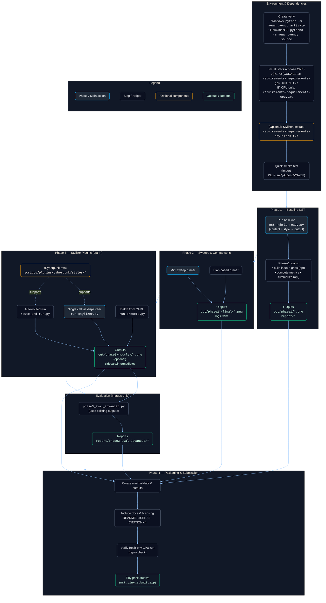

# Neural Style Transfer Project — Setup & Usage

Reproducible **Neural Style Transfer (NST)** baseline with optional **Phase-3 diffusion stylizer plugins** (Anime, Cinematic, Cyberpunk, Noir). This README is structured for quick onboarding, rigorous reproducibility, and smooth grading.


## Table of Contents

1. [What’s Included](#whats-included)  
2. [System Requirements](#system-requirements)  
3. [Environment Setup ](#environment-setup-exact-commands)  
4. [Installation Options ](#installation-options-exact-commands)  
5. [Requirements Files Overview](#requirements-files-overview)  
6. [Quick Smoke Test ](#quick-smoke-test)  
7. [Phase 3 Stylizer Plugins — README ](#phase-3-stylizer-plugins--readme)  
   - [Why this exists](#why-this-exists)  
   - [Directory layout](#directory-layout)  
   - [Prerequisites](#prerequisites)  
   - [Three ways to run](#three-ways-to-run)  
   - [Preset registry](#preset-registry)  
   - [Your exact preset examples](#your-exact-preset-examples)  
   - [Subject routing details](#subject-routing-details)  
   - [Where results go](#where-results-go)  
   - [Troubleshooting](#troubleshooting)  
   - [Clean separation from baseline](#clean-separation-from-baseline)  
8. [Phase 1 – Baseline NST ](#phase-1--baseline-nst-exact-commands)  
9. [Phase 2 – Sweeps & Comparisons ](#phase-2--sweeps--comparisons-exact-commands)  
10. [Phase 3 – Images-Only Evaluation ](#phase-3--images-only-evaluation)  
11. [Reproducibility & Determinism](#reproducibility--determinism)  
12. [Data & Assets (Naming, Masks, Cyberpunk refs)](#data--assets-naming-masks-cyberpunk-refs)  
13. [Results, Reports & Expected Artifacts](#results-reports--expected-artifacts)  
14. [Known Issues & Notes](#known-issues--notes)  
15. [Submission (Phase 4) Checklist](#submission-phase-4-checklist)  
16. [License & Citation](#license--citation)

---

## What’s Included

- **Phases 1–2 (NST baseline):** core style transfer with reproducible runs and evaluation helpers.  
- **Phase 3 (plugins):** opt-in diffusion stylizers (Anime / Cinematic / Cyberpunk / Noir) with routing, presets, and batch tools.  
- **Multiple requirement stacks:** CPU-only, GPU (CUDA 12.1), and stylizer extras.  
- **Clear output structure:** `out/phase1`, `out/phase2*`, `out/phase3/<style>`.

---

## System Requirements

- **OS:** Windows, Linux, or macOS  
- **Python:** 3.10.x (recommended 3.10.11)  
- **Pip:** ≥ 23.0  
- **GPU (optional):** NVIDIA with CUDA 12.1 drivers (for the GPU stack)  
- **Disk:** Ensure sufficient space for model downloads and generated assets

---

## Environment Setup 

### Create a virtual environment

**Windows (PowerShell):**
```powershell
python -m venv .venv
.\.venv\Scripts\activate
python -m pip install --upgrade pip setuptools wheel
````

**Linux/macOS (bash):**

```bash
python3 -m venv .venv
source .venv/bin/activate
python -m pip install --upgrade pip setuptools wheel
```

---

## Installation Options 

Pick **ONE** of the following setups.

### A) GPU (CUDA 12.1)

If you have an **NVIDIA GPU** with CUDA 12.1 drivers:

```bash
pip install -r requirements/requirements-gpu-cu121.txt
```

This file includes:

* PyTorch GPU wheels (`torch`, `torchvision`, `torchaudio`)
* All base libraries via `-r requirements/requirements-base.txt`

✅ Verify GPU install:

```bash
python - << 'PY'
import torch, cv2, numpy as np
print("Torch:", torch.__version__,
      "| CUDA available:", torch.cuda.is_available(),
      "| CUDA build:", torch.version.cuda)
print("OpenCV:", cv2.__version__, "| ximgproc:", hasattr(cv2, "ximgproc"))
print("NumPy:", np.__version__)
PY
```

Expected: `CUDA available: True` and `CUDA build: 12.1`.
Run scripts with `--device cuda`.

---

### B) CPU-only

For machines without NVIDIA GPUs (macOS, some laptops/servers):

```bash
pip install -r requirements/requirements-cpu.txt
```

✅ Verify CPU install:

```bash
python - << 'PY'
import torch
print("Torch:", torch.__version__, "| CUDA available:", torch.cuda.is_available())
PY
```

Expected: `CUDA available: False`.
Run scripts with `--device cpu`.

---

### C) Switching stacks

If you installed one stack but want to switch:

```bash
pip uninstall -y torch torchvision torchaudio
pip install -r requirements-gpu-cu121.txt   # or requirements-cpu.txt
```

---

## Requirements Files Overview

### `requirements/requirements-base.txt`

Core ML/vision stack shared across phases (e.g., Diffusers/Transformers if used, OpenCV contrib, SciPy, NumPy, Matplotlib, utility libs).
⚠️ Only `opencv-contrib-python` is included (avoid mixing with `opencv-python` to prevent conflicts).

### `requirements/requirements-gpu-cu121.txt`

Includes CUDA 12.1 Torch wheels and:

```
--extra-index-url https://download.pytorch.org/whl/cu121
torch==2.5.1+cu121
torchvision==0.20.1+cu121
torchaudio==2.5.1+cu121
-r requirements-base.txt
```

### `requirements/requirements-cpu.txt`

Includes CPU Torch wheels and:

```
--extra-index-url https://download.pytorch.org/whl/cpu
torch==2.5.1
torchvision==0.20.1
torchaudio==2.5.1
-r requirements-base.txt
```

> If you use Phase-3 plugins, also install `requirements/requirements-stylizers.txt`.

---

## Quick Smoke Test 

Run after installation:

```bash
python - << 'PY'
from PIL import Image
import numpy as np, cv2
import torch, torchvision
print("✅ OK: PIL, NumPy, OpenCV, Torch imported successfully.")
print("Torch CUDA available:", torch.cuda.is_available())
PY
```

---

## Phase 3 Stylizer Plugins — README 

This README explains how to run the **Phase-3 diffusion stylizer plugins** (Anime, Cinematic, Cyberpunk, Noir) **without touching the Phase-1/2 NST baseline**. Everything here is opt-in and lives under `scripts/plugins`, `scripts/phase3`, and `configs/phase3`.

### Why this exists

* Keep the NST baseline clean (`scripts/core`).
* Run stylizers only when explicitly requested.
* Make preset selection (portrait vs scene, anime variants) **automatic** but **overridable**.
* Support **single runs**, **auto-routed runs**, and **batch runs from YAML**.

### Directory layout

```
nst-project/
├─ configs/
│  └─ phase3/
│     ├─ preset_registry.yaml
│     ├─ anime_presets.yaml
│     ├─ cinematic_presets.yaml
│     ├─ cyberpunk_presets.yaml
│     └─ noir_presets.yaml
├─ scripts/
│  ├─ core/                     # baseline NST 
│  ├─ plugins/                  # Phase 3 (opt-in)
│  │  ├─ anime/anime_stylize_v2.py
│  │  ├─ cinematic/cinematic_stylize_v5.py
│  │  ├─ cyberpunk/cyberpunk_stylize_v3.py
│  │  │  └─ styles/             # put neon_* refs here
│  │  └─ noir/noir_stylize.py
│  ├─ phase3/
│  │  ├─ run_presets.py         # batch runner for YAML task lists
│  │  └─ route_and_run.py       # auto subject router + runner
│  └─ runners/
│     └─ run_stylizer.py        # tiny dispatcher (calls plugin only on demand)
├─ requirements/
│  ├─ requirements-base.txt     # (your baseline)
│  └─ requirements-stylizers.txt# extras: diffusers, controlnet-aux, etc.
└─ out/
   └─ phase3/                   # all Phase-3 outputs land here
```

### Prerequisites

1. **Python env** (use your existing venv).
2. Install stylizer extras **only when needed**:

   ```powershell
   pip install -r .\requirements\requirements-stylizers.txt
   ```
3. For Cyberpunk, place your style images here:

   ```
   scripts/plugins/cyberpunk/styles/
     neon_street_photo1.jpg
     neon_street_photo2.jpg
     neon_portrait_photo.jpg
   ```
4. Optional (better routing for portraits): keep face masks next to images, e.g.
   `data/content/portrait2.jpg` + `data/content/portrait2_face_mask.png`.

### Three ways to run

#### 1) Single plugin call (no routing)

```powershell
# Anime example (faithful)
python .\scripts\runners\run_stylizer.py --stylizer anime `
  -i .\data\content\portrait2.jpg `
  -o out_anime_faithful.png `
  --stylizer-args "--model primary --control auto --control-scale 0.85 --strength 0.65 --guidance 8.0 --steps 34 --seed 7890 --save-control"
```

**Output location:** if `-o` is not under `out\phase3\...`, the dispatcher will auto-rewrite it to `out\phase3\<style>\...`.

#### 2) Auto-routed run (portrait/scene + anime variant selection)

```powershell
# Auto subject, defaults from registry
python .\scripts\phase3\route_and_run.py --style anime `
  -i .\data\content\portrait2.jpg -o anime_portrait_auto.png

# Manual override: force subject/variant
python .\scripts\phase3\route_and_run.py --style anime `
  -i .\data\content\portrait2.jpg -o anime_B_on_portrait.png `
  --subject portrait --variant stylized

# Another style (auto)
python .\scripts\phase3\route_and_run.py --style cyberpunk `
  -i .\data\content\city.jpg -o cp_city_auto.png
```

**Manual overrides (always available):**

* `--subject portrait|scene`
* `--variant faithful|stylized` (Anime only)
* `--extra "…"` to append any additional plugin flags ad-hoc.

#### 3) Batch presets from YAML

```powershell
# Anime pack
python .\scripts\phase3\run_presets.py --config .\configs\phase3\anime_presets.yaml

# Cyberpunk pack
python .\scripts\phase3\run_presets.py --config .\configs\phase3\cyberpunk_presets.yaml

# Noir pack
python .\scripts\phase3\run_presets.py --config .\configs\phase3\noir_presets.yaml

# Cinematic pack
python .\scripts\phase3\run_presets.py --config .\configs\phase3\cinematic_presets.yaml
```

### Preset registry

`configs/phase3/preset_registry.yaml` maps **style → (portrait/scene or anime variants) → args**. Example (already in your file set):

```yaml
anime:
  portrait_faithful: "--model primary --control auto --control-scale 0.85 --strength 0.65 --guidance 8.0 --steps 34 --seed 7890 --save-control"
  scene_stylized: "--model primary --control auto --control-scale 0.85 --strength 0.70 --guidance 8.5 --steps 32 --seed 7890 --save-control"

cinematic:
  portrait: "--subject portrait --steps 34 --guidance 6.2 --strength 0.24 --control-scale 0.30 --tone-mix 0.22 --bloom 0.22 --contrast 0.18 --saturation 1.06 --seed 77"
  scene: "--subject scene    --steps 36 --guidance 6.6 --strength 0.40 --control-scale 0.50 --tone-mix 0.40 --bloom 0.42 --contrast 0.24 --saturation 1.06 --seed 77"

cyberpunk:
  portrait: "--subject portrait --auto-mask-person --force-inpaint --control depth --control-scale 0.36 --style-image scripts/plugins/cyberpunk/styles/neon_street_photo1.jpg,scripts/plugins/cyberpunk/styles/neon_street_photo2.jpg,scripts/plugins/cyberpunk/styles/neon_portrait_photo.jpg --style-strength 0.50 --strength 0.21 --steps 44 --guidance 6.2 --edge-q 0.987 --skin-suppress 0.95 --skin-keep 0.25 --neon 0.40 --bloom 0.44 --rim-boost 0.42 --scanlines 0 --scheduler dpmpp --refine --refine-strength 0.14 --max-side 1024 --seed 101"
  scene: "--subject scene    --force-inpaint --control canny --control-scale 0.42 --style-image scripts/plugins/cyberpunk/styles/neon_street_photo1.jpg,scripts/plugins/cyberpunk/styles/neon_street_photo2.jpg --style-strength 0.88 --strength 0.32 --steps 60 --guidance 6.8 --edge-q 0.930 --neon 0.90 --bloom 0.80 --rim-boost 0.62 --scanlines 0.10 --scheduler dpmpp --refine --refine-strength 0.20 --max-side 1280 --seed 77"

noir:
  portrait: "--subject portrait --strength 0.18 --guidance 6.0 --steps 34 --noir-halation 0.20 --noir-bloom-sigma 1.9 --noir-bloom-thresh 0.80 --noir-vignette 0.12 --noir-dither 0.003 --noir-gamma 1.02 --noir-gain 1.01 --noir-lift 0.01 --seed 77"
  scene: "--subject scene    --control canny --control-scale 0.62 --strength 0.74 --guidance 6.8 --steps 42 --noir-halation 0.16 --noir-bloom-sigma 1.7 --noir-bloom-thresh 0.88 --noir-vignette 0.15 --noir-dither 0.0035 --noir-gamma 1.02 --noir-gain 1.00 --noir-lift 0.01 --seed 77"
```

### Your exact preset examples (quick copy/paste)

#### Anime — A (faithful) & B (stylized)

```powershell
# A — seed 7890
python .\scripts\runners\run_stylizer.py --stylizer anime `
  -i input.jpg -o out\phase3\anime\A_faithful_s7890.png `
  --stylizer-args "--model primary --control auto --control-scale 0.85 --strength 0.65 --guidance 8.0 --steps 34 --seed 7890 --save-control"

# A — seed 1234
python .\scripts\runners\run_stylizer.py --stylizer anime `
  -i input.jpg -o out\phase3\anime\A_faithful_s1234.png `
  --stylizer-args "--model primary --control auto --control-scale 0.85 --strength 0.65 --guidance 8.0 --steps 34 --seed 1234 --save-control"

# B — seed 7890
python .\scripts\runners\run_stylizer.py --stylizer anime `
  -i input.jpg -o out\phase3\anime\B_stylized_s7890.png `
  --stylizer-args "--model primary --control auto --control-scale 0.85 --strength 0.70 --guidance 8.5 --steps 32 --seed 7890 --save-control"

# B — seed 1234
python .\scripts\runners\run_stylizer.py --stylizer anime `
  -i input.jpg -o out\phase3\anime\B_stylized_s1234.png `
  --stylizer-args "--model primary --control auto --control-scale 0.85 --strength 0.70 --guidance 8.5 --steps 32 --seed 1234 --save-control"
```

#### Cyberpunk — portrait & street

```powershell
# Portrait
python .\scripts\runners\run_stylizer.py --stylizer cyberpunk `
  -i input.jpg -o out\phase3\cyberpunk\out_portrait_cyberpunk_finalBoost.png `
  --stylizer-args "--subject portrait --auto-mask-person --force-inpaint --control depth --control-scale 0.36 --style-image scripts/plugins/cyberpunk/styles/neon_street_photo1.jpg,scripts/plugins/cyberpunk/styles/neon_street_photo2.jpg,scripts/plugins/cyberpunk/styles/neon_portrait_photo.jpg --style-strength 0.50 --strength 0.21 --steps 44 --guidance 6.2 --edge-q 0.987 --skin-suppress 0.95 --skin-keep 0.25 --neon 0.40 --bloom 0.44 --rim-boost 0.42 --scanlines 0 --scheduler dpmpp --refine --refine-strength 0.14 --max-side 1024 --seed 101"

# Street
python .\scripts\runners\run_stylizer.py --stylizer cyberpunk `
  -i street.jpg -o out\phase3\cyberpunk\out_street_cyberpunk_8p5plus.png `
  --stylizer-args "--subject scene --force-inpaint --control canny --control-scale 0.42 --style-image scripts/plugins/cyberpunk/styles/neon_street_photo1.jpg,scripts/plugins/cyberpunk/styles/neon_street_photo2.jpg --style-strength 0.88 --strength 0.32 --steps 60 --guidance 6.8 --edge-q 0.930 --neon 0.90 --bloom 0.80 --rim-boost 0.62 --scanlines 0.10 --scheduler dpmpp --refine --refine-strength 0.20 --max-side 1280 --seed 77"
```

#### Noir — portrait & street

```powershell
# Portrait — Classic Noir
python .\scripts\runners\run_stylizer.py --stylizer noir `
  -i portrait1.jpg -o out\phase3\noir\out_noir_portrait_classic.png `
  --stylizer-args "--subject portrait --strength 0.18 --guidance 6.0 --steps 34 --noir-halation 0.20 --noir-bloom-sigma 1.9 --noir-bloom-thresh 0.80 --noir-vignette 0.12 --noir-dither 0.003 --noir-gamma 1.02 --noir-gain 1.01 --noir-lift 0.01 --seed 77"

# Street — Classic Noir
python .\scripts\runners\run_stylizer.py --stylizer noir `
  -i street.jpg -o out\phase3\noir\out_noir_scene_classic.png `
  --stylizer-args "--subject scene --control canny --control-scale 0.62 --strength 0.74 --guidance 6.8 --steps 42 --noir-halation 0.16 --noir-bloom-sigma 1.7 --noir-bloom-thresh 0.88 --noir-vignette 0.15 --noir-dither 0.0035 --noir-gamma 1.02 --noir-gain 1.00 --noir-lift 0.01 --seed 77"
```

#### Cinematic — “Obsidian Gold”

```powershell
# Portrait (target ~9/10)
python .\scripts\runners\run_stylizer.py --stylizer cinematic `
  -i portrait1.jpg -o out\phase3\cinematic\out_cinematic_portrait_v5.png `
  --stylizer-args "--subject portrait --steps 34 --guidance 6.2 --strength 0.24 --control-scale 0.30 --tone-mix 0.22 --bloom 0.22 --contrast 0.18 --saturation 1.06 --seed 77"

# Scene (target 9+/10)
python .\scripts\runners\run_stylizer.py --stylizer cinematic `
  -i street.jpg -o out\phase3\cinematic\out_cinematic_scene_v5.png `
  --stylizer-args "--subject scene --steps 36 --guidance 6.6 --strength 0.40 --control-scale 0.50 --tone-mix 0.40 --bloom 0.42 --contrast 0.24 --saturation 1.06 --seed 77"
```

---

## Phase 1 – Baseline NST 
> **Phase 1 (Baseline NST) — Quickstart**
>
> 1. **Install deps**
>
>    ```powershell
>    pip install -r requirements\requirements-base.txt
>    ```
>
> 2. **Run baseline on sample pair** (uses built-in `data/content` & `data/style`)
>
>    ```powershell
>    $env:NST_SEED="77"
>    python scripts\core\nst_hybrid_ready.py `
>      --content data\content\Still_Life.jpg `
>      --style   data\style\Van_Gogh.jpg `
>      --output  out\phase1\demo_vg_still.png `
>      --steps 500 --content-weight 1.0 --style-weight 5.0 --tv-weight 1e-6 `
>      --max-side 512
>    ```
>
> 3. **Evaluate Phase-1 baseline**
>
>    ```powershell
>    # Build index (content/style pairs to evaluate)
>    python nst_phase1_toolkit\01_build_master_index.py `
>      --content-dir data\content --style-dir data\style `
>      --out report\phase1_master_index.csv
>
>    # Make a small 3x3 grid teaser (optional)
>    python nst_phase1_toolkit\02_make_grids.py `
>      --index report\phase1_master_index.csv --out report\phase1_grids
>
>    # Compute metrics (PSNR/SSIM, etc.) on produced outputs
>    python nst_phase1_toolkit\03_compute_metrics.py `
>      --index  report\phase1_master_index.csv `
>      --out    report\metrics_baseline.csv
>
>    # Summary/plots (optional)
>    python nst_phase1_toolkit\05_summarize_baseline.py `
>      --metrics report\metrics_baseline.csv --out report\phase1_summary
>    ```
>
> **Artifacts you’ll see**
>
> * `out\phase1\demo_vg_still.png` (stylized result)
> * `report\phase1_master_index.csv`, `report\metrics_baseline.csv`
> * `report\phase1_grids\*.png` (optional), `report\phase1_summary\*`

---

## Phase 2 – Sweeps & Comparisons 

**Option A — Mini sweep (fast, no file edits):**

```powershell
python scripts\phase2\mini_sweep_runner.py `
  --contents "data\content\Still_Life.jpg" `
  --styles   "data\style\Monet.jpg" `
  --sw "15000,25000,30000" `
  --tv "0.0020,0.0032" `
  --edge "0.04" `
  --out-root "out\phase2_demo" `
  --device "cpu" --seed 77 --limit 3 --resume
```

Artifacts: final images in `out\phase2_demo\final\`, log CSV at `out\phase2_demo\log_phase2B.csv` (or `logs\runs_log.csv`).

**Option B — Micro plan (JSON) + runner:**

```powershell
python scripts\exp\phase2b_run.py `
  --plan scripts\phase2\plan_min.json `
  --out_root out\phase2B_demo `
  --device cpu --seed 77 --resume
```

Artifacts: final images in `out\phase2B_demo\final\`, log CSV at `out\phase2B_demo\log_phase2B.csv`.

---

## Phase 3 – Images-Only Evaluation 

**Evaluate existing outputs (no re-generation):**

```powershell
python scripts\phase3\phase3_eval_advanced.py `
  --outputs-glob "Extra\images\*.png" `
  --portrait-input "data\content\portrait2.jpg" `
  --scene-input "data\content\street.jpg" `
  --outdir "report\phase3_eval_advanced"
```

**Artifacts:** `report\phase3_eval_advanced\phase3_metrics_advanced.csv` and `report\phase3_eval_advanced\sidecars\*.json`.

**One-shot smoke test:**

```powershell
python scripts\phase3\smoke_test_phase3.py
```

---



---

## Reproducibility & Determinism

* Deterministic guards and seed handling are implemented (e.g., in `scripts/core/nst_hybrid_ready.py`).
* Set `NST_SEED` before runs for consistent experiments.
* CPU tends to be more deterministic than GPU; use `--device cpu` where strict repeatability is required.

---

## Data & Assets (Naming, Masks, Cyberpunk refs)

* Prefer consistent, **canonical filenames**; avoid duplicates and ambiguous variants.
* Portrait masks (if used): place `*_face_mask.png` alongside the source image.
* Cyberpunk stylizer reference images must be placed under:

  ```
  scripts/plugins/cyberpunk/styles/
  ```
* For grading/submission, keep a minimal sample set in `data/` and a curated set in `out/`.

---

## Results, Reports & Expected Artifacts

* **Phase 1:** `out/phase1/*.png`, reports under `report/` (indexes, metrics, grids, summaries).
* **Phase 2:** `out/phase2*/final/*.png`, CSV logs per run.
* **Phase 3:** `out/phase3/<style>/*.png` (+ JSON sidecars/intermediates if enabled).

Include only representative outputs in your submission to keep size reasonable.

---

## Known Issues & Notes

* If you see `ModuleNotFoundError` for `cv2`, `insightface`, or `rembg`, ensure you installed the appropriate requirements file(s); stylizers require their **extras** file.
* Windows quoting: keep all `--stylizer-args` within **one** quoted string; separate flags by spaces.
* If routing misclassifies, override with `--subject` or provide a good face mask.

---

## Submission (Phase 4) Checklist

* ✅ Keep the commands and structure from this README.
* ✅ Include: `scripts/`, `configs/`, `requirements/`, `README.md`, `LICENSE`, `CITATION.cff`.
* ✅ Minimal `data/` (just enough for demos) and a curated `out/` subset.
* ✅ Verify fresh-env **CPU** run of Phase-1 baseline and at least one Phase-3 preset using exactly the commands above.
* ✅ Ensure all filenames in docs match the actual files in the repo.

---

## License & Citation

Licensed under **MIT** (see `LICENSE`).

Example `CITATION.cff` entry:

```yaml
cff-version: 1.2.0
title: "Neural Style Transfer (NST) & Phase-3 Stylizers"
authors:
  - family-names: "Shafi"
    given-names: "Umar"
license: "MIT"
repository-code: "<your repository URL or 'N/A'>"
date-released: "2025-09-16"
```

---